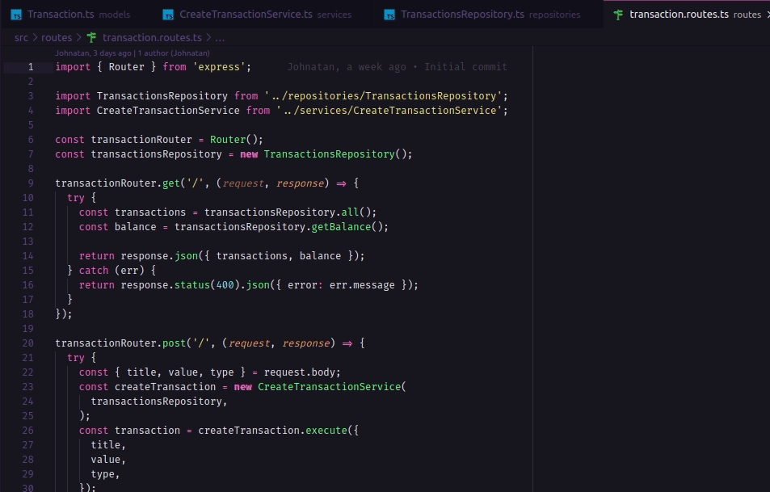

<h2 align="center"><a href="https://rocketseat.com.br/" target="_blank" style="text-decoration: none">
    
    <br>
    Desafio 02 do Bootcamp GoStack
    <br>
    Projeto nodeJS
</a></h2>

<div>
  
</div>

## Descrição

- Este projeto foi desenvolvido com a finalidade de cumprir o desafio 02 do Bootacamp GoStack da [Rocketseat](https://rocketseat.com.br/), utilizando o <strong>[nodeJS](https://nodejs.org/)</strong> para fins de capacitação pessoal.
- A finalidade desse projeto é para armazenar transações financeiras de entrada e saída, que deve permitir o cadastro e a listagem dessas transações.

## Etapas

- Para cumprir o desafio foram utilizadas e configuradas as rotas http GET, POST.

- Na rota GET ela retornar uma listagem com todas as transações que você cadastrou até agora, junto com o valor de soma de entradas, retiradas e total de crédito.

- Na rota POST ela receber title, value e type dentro do corpo da requisição, sendo type o tipo da transação, que deve ser income para entradas (depósitos) e outcome para saídas (retiradas).

- Para cadastrar um repositório foi utilizado o método http POST para a rota "/transactions", passando como requisição body os seguintes dados em formato de json:

```js
{
  "id": "uuid",
  "title": "Salário",
  "value": 3000,
  "type": "income"
}
```

- Caso o valor de retirada, outcome, seja maior que valor de total o sistema retorna uma resposta com código HTTP 400 e uma mensagem de erro.
```js
if (type === 'outcome' && saida.total < value) {
  throw Error('This transaction cannot be performed');
}

```

- Para listar os dados cadastrados foi utilizado o método http GET para a rota "/transactions".

- Neste projeto já foi utilizado dois conceitos do SOLID:
```bash
* S: Single Responsability Principal
* D: Dependency Invertion Principal
```

## Tecnologias

- [nodeJS](https://nodejs.org/)
- [yarn](https://yarnpkg.com/)
- [express](https://github.com/expressjs/express)
- [nodemon](https://github.com/remy/nodemon)
- [uuidv4](https://github.com/thenativeweb/uuidv4)

---

Desenvolvido por [Johnatan Luiz Osterloh](https://www.linkedin.com/in/johnatanosterloh/)
